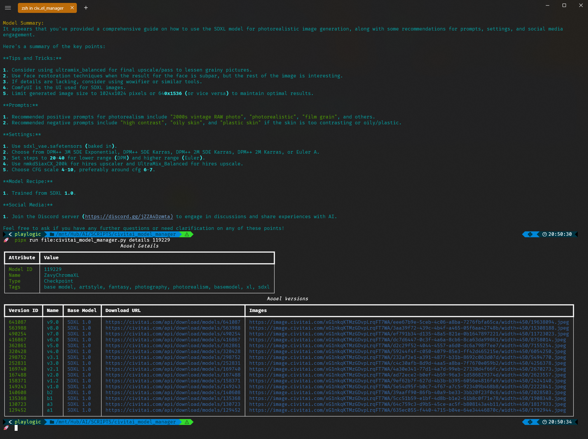

# Civitai Model Manager

> [!WARNING] 
> This tool is provided "as-is". It has primarily been used/tested on Ubuntu systems; YMMV on Windows/Subsystem...


## Overview

**Civitai Model Manager** is a Command Line Interface (CLI) tool I created to streamline the process of retrieving and managing AI models from the **CivitAI platform**. This came about as a solution to my own frustrations with the cumbersome Civitai website interface, which often felt slow and required an excessive number of clicks to download models.

I initially intended for this to be just a module in a larger **Comfy CLI** toolset, but I found it so useful in its standalone format that I decided to share it with anyone who might feel the same way.



## Why

The main reason I developed this tool was to address my own challenges: navigating through numerous clicks and waiting for slow downloads on the website. I needed a more efficient way to organize and manage my AI models, and the result is this CLI tool that allows me (and you) to store models in a centralized directory. The tool also allows for a quick model summary via the Ollama(OpenAI) API, which is a great way to get a quick overview of a model's capabilities without having to download it first or read a lengthy description.

## Key Features

- **Quick Model Listing**: This tool will quickly list all available models alongside their types and storage paths.

- **Categorical Inspection**: It counts models categorized by type, providing insightful organization at a glance.

- **Detailed Insights**: It retrieves comprehensive information about specific models using their IDs.

- **Effortless Downloads**: You can download selected model variants with ease, avoiding the tedious web interface.

- **Simplified Removals**: Easily remove unnecessary models from local storage to keep things tidy.

- **Summarized Descriptions**: Get summaries of specific models by using Ollama's API for enhanced understanding.

## Installation

You have a couple of options for installing/running the tool:

### Install [pipx](https://pipxproject.github.io/pipx/installation/), then run the tool with the following command:

```bash
pipx run file:comfy_model_manager.py [OPTIONS]
```

### Alternatively, you can install using `pip`

You can also install the required dependencies using the `setup.py` file or a `requirements.txt`. To do this, simply clone the repository and run:

```bash
pip install -r requirements.txt
```

or

```bash
python setup.py install
```

Run tests with:

```bash
python test_civitai_model_manager.py
```

### Configuration

> [!IMPORTANT] 
> Before using the tool, Its required to set up a `.env` file parent directory of the script or your home dir with the following environment variables:

```env
CIVITAI_TOKEN=# obtain from https://developer.civitai.com/docs/getting-started/setup-profile#create-an-api-key
MODELS_DIR=# /location/of/your/models/

OLLAMA_API_BASE=http://localhost:11434
OLLAMA_MODEL=llama3.1 # Note: not all models follow the system template...

OPENAI_MODEL=gpt-4o-mini
OPENAI_API_KEY=# sk-proj
```

The application intelligently locates your `.env` file, accommodating various platforms like Windows and Linux, or defaulting to the current directory.

## Usage


> [!NOTE]  
> Make sure to grab the main model ID from the Civitai website and not the model variant ID. The model ID is the number in the URL after `/models/`, like so: https://civitai.com/models/`277058`/epicrealism-xl

### Available Commands
```bash
# List all available models
python civitai_model_manager.py --list

# Inspect and count models by type
python civitai_model_manager.py --inspect

# Get detailed information about a specific model
python civitai_model_manager.py --details 12345

# Download a specific model variant
python civitai_model_manager.py --download 54321

# Download a specific model variant, version id can be found using the details command
python civitai_model_manager.py --download 54321 --version 453435

# Remove models from local storage
python civitai_model_manager.py --remove

# Get a summary of a specific model
python civitai_model_manager.py --summarize 12345
```

## Dependencies

This tool requires Python 3.11 or higher and has the following dependencies:

```plaintext
- typer
- rich
- requests
- shellingham
- tqdm
- civitai
- python-dotenv
- ollama
- openai
```

These dependencies enhance usability, including user interactions, downloadable progress visuals, and environment variable management.

## To-Do List

- [ ] Add search locations for `.env`
- [ ] Add Hugging Face API
- [ ] Add groqCloud integration
- [ ] Add sanity checks for permissions, folder locations, feedback
- [ ] Add feature to download a update to a model if it already exists

## License

This project is licensed under the [MIT License](LICENSE).

## Contact

For any inquiries, feedback, or suggestions, please feel free to open an issue on this repository.

---
